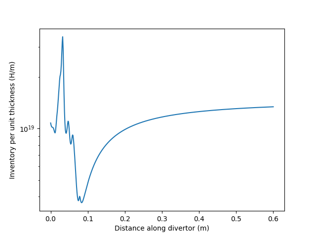

.. divHretention documentation master file

divHretention
=============

.. toctree::
   :maxdepth: 2

   example_usage
   API

Installation
------------

.. code-block:: bash

   pip install divHretention

Basic usage
-----------

.. code-block:: python

   import matplotlib.pyplot as plt
   import numpy as np
   from divHretention import compute_inventory

   arc_length = np.linspace(0, 1)  # arc length (m) along the divertor
   T = 1100*np.exp(-arc_length)  # temperature (K) profile
   concentration = 1e20*np.exp(-arc_length)  # surface concentration (H m-3)

   # compute the inventory (H/m) and standard deviation at 10 000s
   inv, sig = compute_inventory(T, concentration, time=1e4)

   plt.plot(arc_length, inv)
   plt.xlabel("Distance along divertor (m)")
   plt.ylabel("Inventory per unit thickness (H/m)")
   plt.show()

From an input file
------------------

.. code-block:: python

   import matplotlib.pyplot as plt
   import numpy as np

   from divHretention import process_file
   filenames = [
         "data/exposure_conditions_divertor/WEST/West-LSN-P1.6e+21-IP0.449MW.csv",
         "data/exposure_conditions_divertor/WEST/West-LSN-P2.5e+21-IP1.500MW.csv",
   ]

   for i, filename in enumerate(filenames):
         res = process_file(filename, filetype="WEST")
         plt.plot(res.arc_length, res.inventory, label="Case {}".format(i+1))

   plt.legend()
   plt.xlabel("Distance along divertor (m)")
   plt.ylabel("Inventory per unit thickness (H/m)")
   plt.yscale("log")
   plt.show()

Under the hood
--------------

This tool relies on a database of FESTIM simulations of monblocks under various exposure conditions (see figure below).

The monoblock hydrogen inventory is computed for each of these exposure conditions and a Gaussian Regression is made:

This behaviour law is then used to compte the monoblock inventory for any exposure condition.

References
----------

* Delaporte-Mathurin, Rémi, Etienne A. Hodille, Jonathan Mougenot, Yann Charles, and Christian Grisolia. 2019. ‘Finite Element Analysis of Hydrogen Retention in ITER Plasma Facing Components Using FESTIM’. Nuclear Materials and Energy 21 (December): 100709. https://doi.org/10.1016/j.nme.2019.100709.
* Delaporte-Mathurin, Rémi, Etienne Hodille, Jonathan Mougenot, Gregory De Temmerman, Yann Charles, and Christian Grisolia. 2020. ‘Parametric Study of Hydrogenic Inventory in the ITER Divertor Based on Machine Learning’. Scientific Reports 10 (1): 17798. https://doi.org/10.1038/s41598-020-74844-w.

Indices and tables
==================

* :ref:`genindex`
* :ref:`modindex`
* :ref:`search`
